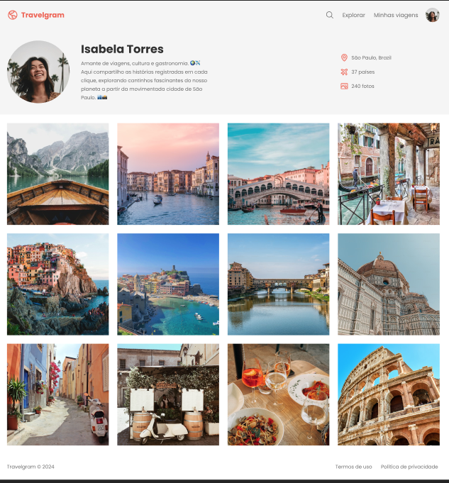

# Travelgram

Projeto simples de front-end, proposto pela **Rocketseat**, desenvolvido com **HTML** e **CSS**.

A página simula um perfil de viagens com:
- barra de navegação,
- seção de perfil,
- galeria de fotos,
- rodapé com links.

## 🛠️ Tecnologias

- HTML5
- CSS3

## 📁 Estrutura

```text
.
├── index.html
├── assets/
│   ├── icons/
│   └── images/
└── styles/
    ├── footer.css
    ├── global.css
    ├── header.css
    ├── index.css
    ├── main.css
    └── nav.css
```

## ▶️ Como executar

Como é um projeto estático, basta abrir o arquivo `index.html` no navegador.

### Opção 1: Abrir diretamente
- Clique duas vezes em `index.html`

### Opção 2: Usar servidor local (recomendado)
Se tiver Python instalado, execute:

```bash
cd /home/aalbano/Documents/Projecto-trevalgram
python3 -m http.server 5500
```

Depois acesse:

`http://localhost:5500`

## 📸 Preview do Projeto



## 📚 Créditos

Projeto proposto pela **Rocketseat** para prática de HTML e CSS.
